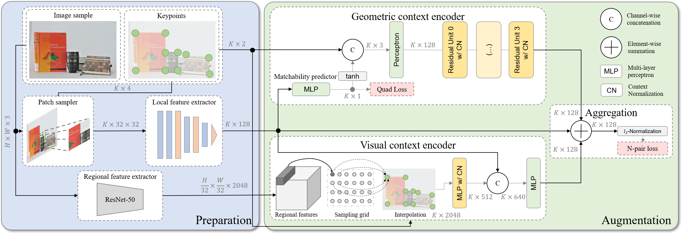

# ContextDesc implementation



TensorFlow implementation of ContextDesc for CVPR'19 paper (oral) ["ContextDesc: Local Descriptor Augmentation with Cross-Modality Context"](https://arxiv.org/abs/1904.04084), by Zixin Luo, Tianwei Shen, Lei Zhou, Jiahui Zhang, Yao Yao, Shiwei Li, Tian Fang and Long Quan.

This paper focuses on augmenting off-the-shelf local feature descriptors with two types of context: the visual context from high-level image representation, and geometric context from keypoint distribution. If you find this project useful, please cite:

```
@article{luo2019contextdesc,
  title={ContextDesc: Local Descriptor Augmentation with Cross-Modality Context},
  author={Luo, Zixin and Shen, Tianwei and Zhou, Lei and Zhang, Jiahui and Yao, Yao and Li, Shiwei and Fang, Tian and Quan, Long},
  journal={Computer Vision and Pattern Recognition (CVPR)},
  year={2019}
}
```

## Requirements

Please use Python 2.7, install NumPy, OpenCV (3.4.2) and TensorFlow (1.12.0). To run the image matching example, you may also need [opencv_contrib](https://github.com/opencv/opencv_contrib) to enable SIFT.

## Pre-trained model

A ContextDesc model comprises three submodels: raw local feature descriptor (including matchability predictor), regional feature extractor and feature augmentation model. We temporally provide models in Tensorflow Protobuf format for simplicity.

|                      | Local                                                               | Regional                                                          | Augmentation                                                            | Descriptions                                                                                    |
|----------------------|---------------------------------------------------------------------|-------------------------------------------------------------------|-------------------------------------------------------------------------|-------------------------------------------------------------------------------------------------|
| contextdesc-base     | [Link](http://home.cse.ust.hk/~zluoag/data/contextdesc-base.pb)     | [Link](http://home.cse.ust.hk/~zluoag/data/retrieval_resnet50.pb) | [Link](http://home.cse.ust.hk/~zluoag/data/contextdesc-base-aug.pb)     | Use original [GeoDesc](https://github.com/lzx551402/geodesc) [[1]](#refs) (ECCV'18) as the base local model. |
| contextdesc-sa-npair | [Link](http://home.cse.ust.hk/~zluoag/data/contextdesc-sa-npair.pb) | -                                                                 | [Link](http://home.cse.ust.hk/~zluoag/data/contextdesc-sa-npair-aug.pb) | (Better) Retrain GeoDesc with the proposed scale-aware N-pair loss as the base                  |
| contextdesc-e2e      | [Link](http://home.cse.ust.hk/~zluoag/data/contextdesc-e2e.pb)      | -                                                                 | [Link](http://home.cse.ust.hk/~zluoag/data/contextdesc-e2e-aug.pb)      | (Best performance) End-to-end train local and augmentation models.                              |


# Training data

Part of the training data is released in [GL3D](https://github.com/lzx551402/GL3D). Please also cite [MIRorR](https://github.com/hlzz/mirror) [[2]](#refs) if you find this dataset useful for your research.

## Example scripts

### 1. Test image matching

To get started, clone the repo and download the pretrained model:
```bash
git clone https://github.com/lzx551402/contextdesc.git
cd contextdesc/models
wget http://home.cse.ust.hk/~zluoag/data/contextdesc-e2e.pb
wget http://home.cse.ust.hk/~zluoag/data/contextdesc-e2e-aug.pb
wget http://home.cse.ust.hk/~zluoag/data/retrieval_resnet50.pb
```

then simply run:

```bash
cd contextdesc/examples
python image_matching.py
```

The matching results from SIFT (top), base local descriptor (middle) and augmented descriptor (bottom) will be displayed. Type `python image_matching.py --h` to view more options and test on your own images.

### 2. (TODO) Evaluation on HPatches Sequences 

Download [HPSequences](http://icvl.ee.ic.ac.uk/vbalnt/hpatches/hpatches-sequences-release.tar.gz) (full image sequences of [HPatches](https://github.com/hpatches/hpatches-dataset) [[3]](#refs) and their corresponding homographies).

### References
<a name="refs"></a>

[1] GeoDesc: Learning Local Descriptors by Integrating Geometry Constraints, Zixin Luo, Tianwei Shen, Lei Zhou, Siyu Zhu, Runze Zhang, Yao Yao, Tian Fang, Long Quan, ECCV 2018

[2] Matchable Image Retrieval by Learning from Surface Reconstruction, Tianwei Shen, Zixin Luo, Lei Zhou, Runze Zhang, Siyu Zhu, Tian Fang, Long Quan, ACCV 2018.

[3] HPatches: A benchmark and evaluation of handcrafted and learned local descriptors, Vassileios Balntas*, Karel Lenc*, Andrea Vedaldi and Krystian Mikolajczyk, CVPR 2017.
